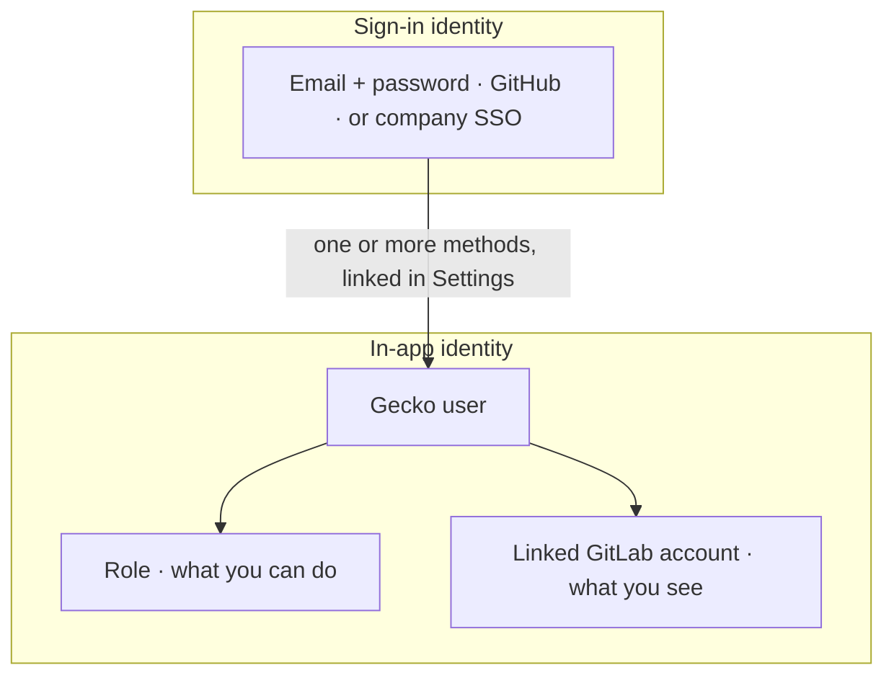
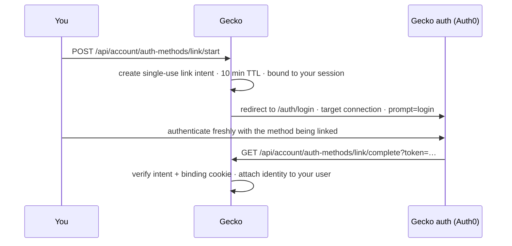
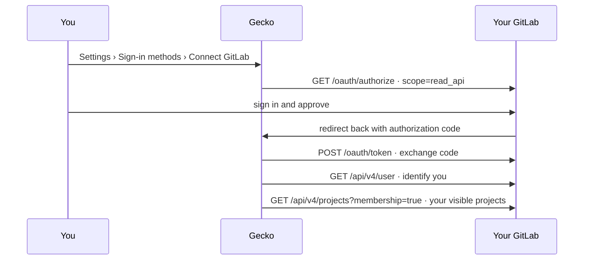

A person using Gecko has exactly two identities:

1. **Sign-in identity**: how you prove who you are. Email and password,
   GitHub, or your company's SSO.
2. **In-app identity**: who you are once signed in. Your Gecko user, a
   member of a team, with a role and a linked GitLab account.

## Sign-in identity

How you get in, and nothing more. Gecko accepts these methods:

- **Email and password**
- **GitHub sign-in**
- **Company SSO** (SAML or OIDC), started from your team's
  [sign-in URL](/access/self-managed-sso)

They all land you in the same Gecko user. Once your team switches
[SSO enforcement](/access/self-managed-sso#the-settings-one-by-one) to
**Required**, only the SSO method is accepted; sessions from the other two
are blocked.

A sign-in method carries no permissions. Signing in with GitHub doesn't show
Gecko your repositories, and a SAML assertion doesn't grant access to
anything; at most, IdP groups map to a role.

## In-app identity

Your Gecko user is where permissions actually live, on two axes:

| Axis | What it controls |
| --- | --- |
| **[Role](/teams-permissions)** | What you can do: Admin, Manager, Member, or Read Only. Assigned in Gecko, or mapped from IdP groups. |
| **Linked GitLab account** | What you see: of the repositories your team's [connection](/connect/gitlab-self-managed) syncs, the ones your own GitLab user can access. |

Your Gecko user can have **several sign-in methods linked** to it, so your
in-app identity (membership, role, audit history) stays the same while your
sign-in options change. **Settings** > **Sign-in methods** lists each
connected method with its email, and offers:

| Option | What it does |
| --- | --- |
| **Connect GitHub** | Links GitHub sign-in to your existing account. Shown until you've connected it. |
| **Connect SSO** | Links your company SSO identity to your existing account. Shown once your team has [SSO set up](/access/self-managed-sso); do this before your team enforces SSO so you keep your account. |
| **Remove** | Detaches a sign-in method. Blocked on your last remaining method, and on the SSO method while one of your teams requires SSO. |
| **Merge accounts** | If a method you're linking already belongs to another Gecko profile, consolidates the two profiles into one account. |

Your profile email can be set to the email of any connected sign-in method.

### How sign-in linking works

Linking is an **OAuth 2.0 / OIDC authentication** through Gecko's auth
service (Auth0), not an API authorization. Linking GitHub proves you own the
GitHub account and nothing more: Gecko receives an identity claim, not an
access token with repository scope, and it never sees your password for any
method.

The flow is deliberately strict:

- **Fresh authentication is required** (`prompt=login`): an existing browser
  session with the target method is not accepted.
- **The intent is single-use and expires in 10 minutes**, and it's bound to
  the session that started it with a cookie, so a link can't be initiated on
  one machine and completed on another.
- **Conflicts never merge silently.** If the identity you authenticated with
  already belongs to another Gecko profile, the link stops and you're offered
  the explicit account-merge flow instead.

### GitLab account linking

Repository visibility is personal: you link your **own GitLab account** to
your Gecko user, and Gecko enforces your GitLab permissions in the
dashboard. You see a repository only if the team connection synced it
**and** your GitLab user can access it. Until you link, no repositories
appear; linking is the last step of onboarding.

The link is a standard **OAuth 2.0 authorization-code flow against your
GitLab instance**, with a read-only scope:

What it does and doesn't do:

- **Read-only.** The `read_api` scope can't write anything. Scanning, MR
  comments, and fix MRs stay on the team's
  [service account PAT](/connect/gitlab-self-managed), which this flow never
  touches. Gecko never acts as you in GitLab.
- **Self-managed instances need one admin step first**: registering an OAuth
  application on the instance (Gecko can't pre-register one on your server)
  and entering its Application ID and Secret in Gecko. See
  [Enable user linking](/connect/gitlab-self-managed#enable-user-linking).
- **Revocable from both sides.** Unlink in Gecko, or revoke the
  authorization from your GitLab profile's applications settings. Either way
  your dashboard visibility is gone until you link again.

### Connected accounts

**Settings** > **Authentication** also lists your **connected accounts**:
your identities on GitHub, GitLab, Slack, Linear, and Jira. These are about
*attribution* (showing the right name and avatar next to your commits, PRs,
and tickets), not access.

Each row shows the provider, your handle and avatar, and a status:

| Status | Meaning |
| --- | --- |
| **Connected** | A confirmed identity, you linked it yourself or signed in with it. |
| **Suggested** | An unconfirmed match, found in your team's provider directory, or seen on commits and PRs with your email. Confirm with **That's me** or clear it with **Remove**. |

GitLab identities are tracked **per instance**: an account on your
self-managed GitLab is a distinct identity from an account with the same
user ID on GitLab.com or another instance, so identities from different
instances can never collide.

## FAQ

<AccordionGroup>
  <Accordion title="Can we give a user access to only some repositories?">
    That's the default. Each user sees only the synced repositories their own
    GitLab account can access, so your GitLab permissions are the single
    source of truth. To narrow what exists in Gecko at all, scope the team
    connection's memberships.
  </Accordion>
  <Accordion title="I signed in but see no repositories. Why?">
    Either you haven't [linked your GitLab account](#gitlab-account-linking)
    yet, or your GitLab user isn't a member of any project the team
    connection syncs. If the whole team sees nothing, the
    [connection](/connect/gitlab-self-managed) itself isn't set up.
  </Accordion>
  <Accordion title="Someone left the company. What do we clean up?">
    Unassign them from the Gecko app in your IdP (stops sign-in) and remove
    them from **Settings** > **Members**, which removes their linked
    accounts with them. The team's source-control connection is unaffected;
    surviving offboarding is exactly why it runs on a
    [service account](/connect/gitlab-self-managed#why-a-service-account),
    not on an employee's credentials.
  </Accordion>
  <Accordion title="Why do MR comments come from gecko-security and not from me?">
    Everything Gecko writes to your Git provider (MR comments, fix branches,
    fix MRs) runs on the team's connection, so GitLab attributes it to the
    service account. Your linked GitLab account is read-only and only shapes
    what you see. Actions inside the Gecko dashboard are logged against your
    Gecko user in the [audit log](/admin/audit-log).
  </Accordion>
</AccordionGroup>
