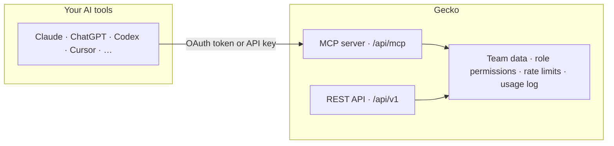
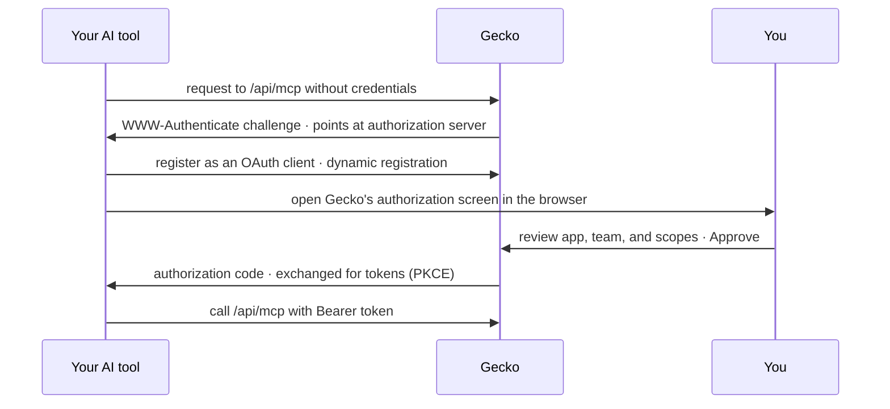

Gecko hosts a remote [MCP](https://modelcontextprotocol.io) server at:

```
https://app.gecko.security/api/mcp
```

Connect it to an AI tool and the tool can list your repositories and scans,
pull full vulnerability evidence (proof of concept, call chain, patch diff),
triage findings, and file tickets. Every call is scoped to one team and
capped by the connecting user's Gecko role; nothing a tool does can exceed
what that person could do in the dashboard.

| At a glance | |
| --- | --- |
| **Endpoint** | `https://app.gecko.security/api/mcp` (Streamable HTTP, stateless) |
| **Auth** | OAuth with PKCE, or a [Gecko API key](/admin/api-keys) as a bearer header |
| **Who can connect** | Users with the `api_keys.manage` permission, on a Pro or Enterprise team |
| **What a tool gets** | 8 typed tools and 3 packaged prompts, capped by your role |
| **Where it's managed** | **Settings** &gt; **Integrations** &gt; **Agents** |

## How it works

The MCP server is a thin transport in front of the same service boundary the
[REST API](/api-reference/introduction) uses. There is no MCP-specific
business logic: the same permissions, rate limits, and usage logging apply to
both surfaces.



The server is stateless: no sessions, no SSE. Every request carries its own
credential, which is why ephemeral environments (CI, cloud sandboxes)
reconnect with zero setup.

## Set up your tool

Each client has a guided setup page in the product under **Settings** &gt;
**Integrations** &gt; **AI Integrations**, and a matching guide here:

<CardGroup cols={2}>
  <Card title="Claude & Claude Desktop" href="/ai-tools/claude">
    Add a custom connector on claude.ai; no API key needed.
  </Card>
  <Card title="Claude Code" href="/ai-tools/claude-code">
    One CLI command, then authenticate in the browser.
  </Card>
  <Card title="Codex" href="/ai-tools/codex">
    CLI, IDE, and Codex Cloud via an API key.
  </Card>
  <Card title="ChatGPT" href="/ai-tools/chatgpt">
    Custom connector with OAuth; no API key needed.
  </Card>
  <Card title="Cursor, Devin & other clients" href="/ai-tools/other-clients">
    One-click Cursor install, plus a generic config for any MCP client.
  </Card>
</CardGroup>

## Two ways to authenticate

Both produce the same authenticated context; pick whichever your client
supports.

| Method | How it works | Best for |
| --- | --- | --- |
| **OAuth** | Click Connect in your tool and approve Gecko's authorization screen. No secret is pasted anywhere, and you can narrow the granted scopes per connection. | Claude, ChatGPT, Cursor, Claude Code |
| **API key** | Create a key under **Settings** &gt; **API Keys** and send it as `Authorization: Bearer gk_…` (or `X-API-Key`). The key can do anything your role allows; there is no per-connection narrowing. | Codex, headless and CI clients, tools without OAuth support |

<Note>
  Connecting requires the `api_keys.manage` permission and a **Pro or
  Enterprise** team. It's the same gate as creating an API key, because an
  agent connection is the same kind of long-lived programmatic credential.
</Note>

### What happens when you click Connect

Your tool discovers Gecko's authorization server, registers itself, and opens
the consent screen. There is no pre-registration step and no client secret;
the flow is OAuth with PKCE, designed for public clients.



### The authorization screen, field by field

| Field | What to check |
| --- | --- |
| **App** | The client asking for access. An **Unverified** badge means Gecko can't prove the app's identity (anyone can register a client under any name); only approve connections you started yourself. |
| **Redirects to** | Where you'll be sent after approving: a website for hosted tools, or a loopback/app URI (like `cursor://`) for CLI and desktop clients. |
| **Team** | Which team the connection will access. If you belong to several qualifying teams, pick one here; the grant is per team, never account-wide. |
| **Access** | The exact scopes being granted, as plain labels. If the client didn't request specific scopes, the grant covers everything your role allows. |

Access is capped by your role and stops the moment it changes. You can
disconnect any time from **Settings** &gt; **Integrations**.

## What the tools can do

All eight tools return typed, structured output, and reads are marked
read-only for clients that surface that. Permissions map one-to-one onto the
REST API's catalog.

| Tool | Permission | What it does |
| --- | --- | --- |
| `list_repositories` | `repos.read` | Tracked repositories with open-vulnerability counts |
| `get_repository` | `repos.read` | One repository by `owner/repo` |
| `list_scans` | `scans.read` | Scans, filterable by repository and status |
| `get_scan` | `scans.read` | One scan: status, progress, severity counts |
| `list_vulnerabilities` | `vulns.read` | Findings, filterable by severity, status, type, CWE, scan, or repository |
| `get_vulnerability` | `vulns.read` | Full evidence: description, proof of concept, call chain, CVSS, patch diff |
| `triage_vulnerability` | `vulns.fix` / `vulns.dismiss` / `vulns.accept_risk` / `vulns.reopen` | Triage a finding, with a reason recorded in the audit trail |
| `create_ticket` | `tickets.create` | File one ticket for up to 25 findings in Jira, Linear, ClickUp, or Shortcut |

The server also ships packaged prompts (`triage_criticals`,
`security_review`, and `fix_finding`) that appear as slash commands in
clients that support MCP prompts, with repository-name autocomplete.

## How access is scoped

Scopes **are** Gecko role permissions: one vocabulary, no mapping table.

| Scope | Label on the consent screen | Write? |
| --- | --- | --- |
| `repos.read` | Read repositories | No |
| `scans.read` | Read scans | No |
| `vulns.read` | Read findings | No |
| `vulns.fix` | Confirm findings | Yes |
| `vulns.dismiss` | Dismiss findings | Yes |
| `vulns.accept_risk` | Accept risk | Yes |
| `vulns.reopen` | Reopen findings | Yes |
| `tickets.create` | Create tickets | Yes |

A connection's granted scopes are a **ceiling, not an entitlement**. Every
request re-derives *your current role's permissions ∩ the scopes you
granted*, so:

- Demote the granting user and every connection they approved narrows
  immediately, with no revocation bookkeeping.
- Remove them from the team and their connections stop working entirely.
- A read-only connection stays read-only even if the client later asks for
  more; scopes never widen after consent.

<Tip>
  Want a tool that can read findings but never triage or file tickets?
  Connect it via OAuth and it receives only the scopes on the consent
  screen. An API key can't be narrowed this way, which is why the product
  steers scope-limited use toward OAuth.
</Tip>

## Manage connections

Connected tools are listed under **Settings** &gt; **Integrations** &gt;
**Agents**, one row per tool and credential.

- **Disconnect** revokes the credential first and removes the row second, so
  a disconnected tool can never keep a working token.
- Anyone can disconnect a tool running on their **own** credential.
  Disconnecting a teammate's requires `api_keys.manage`.
- Deleting an API key under **Settings** &gt; **API Keys** also kills any
  tool connected with that key, immediately.

## For your security team

1. **What can a connected tool access?** Only the team chosen at consent,
   only within the granting user's role, and only through eight typed tools.
   There is no raw data export, no code access, and no way to reach a second
   team through one grant.
2. **How are tokens protected?** The OAuth flow is PKCE-only with no client
   secrets. Tokens are opaque random strings, stored only as SHA-256 hashes;
   refresh tokens rotate on every use, and authorization codes are one-time.
3. **Can an attacker register a fake "Claude"?** Client names are
   self-reported, which is exactly why the consent screen brands apps only by
   their **validated redirect URI** and shows an **Unverified** badge
   otherwise. The screen tells users to approve only connections they
   started.
4. **What's logged?** Every MCP request lands in the same per-request usage
   log as the REST API, and every triage action taken by a tool records its
   reason like a dashboard action, visible in the [audit log](/admin/audit-log).
5. **How do we revoke access?** Disconnect the tool in **Settings** &gt;
   **Integrations**, delete the underlying API key, or change the granting
   user's role. All three take effect on the next request.
6. **What are the rate limits?** Shared with the REST API, per credential and
   [plan tier](/api-reference/introduction#rate-limits). Malformed or
   unauthorized probes are billed against the limit too, so the endpoint
   can't be fuzzed for free.

## Troubleshooting

<AccordionGroup>
  <Accordion title="The Approve button is replaced by a plan message">
    *"Agent connections are available on Pro and Enterprise plans."* The team
    selected on the consent screen is on the Free tier. Switch the team
    picker to a Pro or Enterprise team, or upgrade the team.
  </Accordion>
  <Accordion title="No team appears on the consent screen">
    The team picker only offers teams where you hold the `api_keys.manage`
    permission and at least one requested scope. Ask a team admin to either
    grant you that permission or connect the tool themselves.
  </Accordion>
  <Accordion title="The tool connects but every call is denied">
    Your role lost the permissions behind the granted scopes; the connection
    is a ceiling on your live role, not a stored copy of it. Check your
    [role](/teams-permissions), or reconnect after it's restored.
  </Accordion>
  <Accordion title="My client says the server doesn't support sessions or SSE">
    That's by design. The server is stateless Streamable HTTP: `GET` and
    `DELETE` return `405`, and every request must carry its own credential.
    Use a client that supports Streamable HTTP (all clients on the setup
    pages do).
  </Accordion>
  <Accordion title="Verify connectivity from the command line">
    ```bash
    curl -s https://app.gecko.security/api/mcp \
      -H "Authorization: Bearer $GECKO_API_KEY" \
      -H "Content-Type: application/json" \
      -d '{"jsonrpc":"2.0","id":1,"method":"server/discover","params":{}}'
    ```

    A `result.supportedVersions` array in the response means the endpoint,
    your network, and your credential are all fine, and any remaining problem
    is in the client's configuration.
  </Accordion>
</AccordionGroup>

## FAQ

<AccordionGroup>
  <Accordion title="OAuth or API key: which should we standardize on?">
    OAuth, wherever the client supports it. It never exposes a pasteable
    secret, it can be narrowed per connection, and revoking it doesn't
    disturb anything else. Use API keys for clients that can only send a
    static header (Codex, most CI), and treat each key like the credential it
    is: named, rotated, and deleted when its tool is retired.
  </Accordion>
  <Accordion title="Is this the same OAuth as GitLab account linking?">
    No. For agent connections Gecko is the **authorization server**: it
    issues tokens to your AI tools. For
    [account linking](/access/identity-model#gitlab-account-linking) Gecko is
    the **client**, receiving a read-only token from your GitLab. The two
    flows share nothing but the protocol.
  </Accordion>
  <Accordion title="What happens when the person who connected a tool leaves?">
    Their connections die with their team membership: every request re-checks
    the granting user's role, and a removed user has none. For durable,
    person-independent automation, use the [REST API](/api-reference/introduction)
    with a named API key instead, and rotate it on your schedule.
  </Accordion>
  <Accordion title="Can a tool see our source code?">
    No. The tools expose scan results and finding evidence, which includes
    short code snippets in the proof of concept and patch diff for a finding,
    but there is no tool that clones, lists, or reads repository contents.
  </Accordion>
  <Accordion title="Does MCP traffic share the API rate limit?">
    Yes. One credential has one budget across both surfaces, per your
    [plan tier](/api-reference/introduction#rate-limits). A chatty agent
    can consume the same key's REST headroom, which is a reason to give
    heavy automations their own key.
  </Accordion>
</AccordionGroup>
