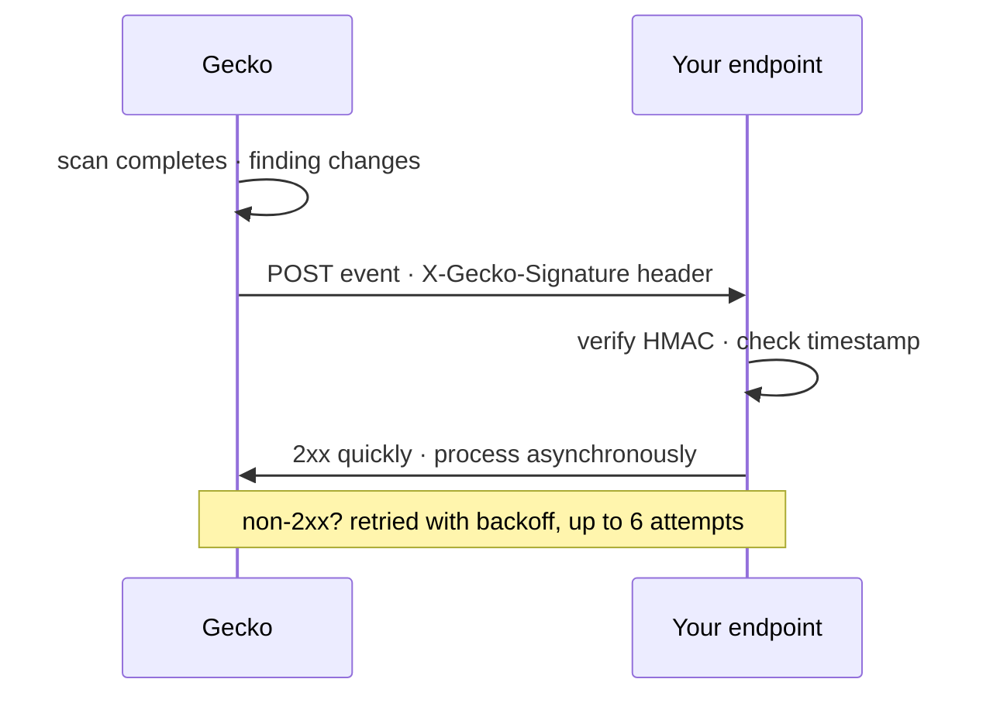

Gecko can push events to your systems as scans run and findings change: page
a channel when a scan fails, open a workflow when a critical lands, or mirror
status changes into an internal system of record. Endpoints are managed
through the API under `/api/v1/webhooks` (permission: `webhooks.manage`).

<Note>
  These are **outbound events from Gecko to you**, not the inbound
  [repository webhooks](/connect/webhooks) your Git provider sends to Gecko.
</Note>



## Event types

| Event | Fires when |
| --- | --- |
| `scan.started` | A scan begins |
| `scan.completed` | A scan finishes successfully |
| `scan.failed` | A scan fails |
| `vulnerability.found` | A new finding is created |
| `vulnerability.status_changed` | A finding is triaged or its status changes |
| `repository.scan_completed` | A repository's scan completes |
| `schedule.triggered` | A scheduled scan is kicked off |

## Create an endpoint

```bash
curl https://app.gecko.security/api/v1/webhooks \
  -H "Authorization: Bearer $GECKO_API_KEY" \
  -H "Content-Type: application/json" \
  -d '{
    "url": "https://example.com/hooks/gecko",
    "events": ["scan.completed", "vulnerability.found"]
  }'
```

Endpoint URLs must be **public HTTPS URLs**. Loopback, private, and
link-local addresses and internal hostnames are rejected when you create or
update the endpoint, and checked again at delivery time, so a DNS change
can't later redirect deliveries into a private network.

<Warning>
  The response includes the signing `secret` exactly once, at creation. Store
  it securely; it is never returned again. Even an idempotent replay of the
  same create request returns the endpoint **without** the secret.
</Warning>

## Verify signatures

Every delivery is signed so you can prove it came from Gecko and wasn't
tampered with. The `X-Gecko-Signature` header has the form:

```
t=<unix-seconds>,v1=<hex hmac>
```

where the HMAC-SHA256 is computed over `<t>.<body>` with your endpoint
secret. Verify every delivery before acting on it:

<Steps>
<Step title="Parse the header">
  Split on commas: `t` is the delivery timestamp, `v1` is the signature.
</Step>
<Step title="Recompute the signature">
  Concatenate the timestamp, a period, and the **raw** request body, then
  compute HMAC-SHA256 with your secret. Use the raw bytes; re-serializing
  the JSON will change the signature.
</Step>
<Step title="Compare timing-safely and reject stale timestamps">
  Use a constant-time comparison, and reject deliveries older than a few
  minutes to block replays.
</Step>
</Steps>

<CodeGroup>
```javascript Node.js
import { createHmac, timingSafeEqual } from "node:crypto";

function verifyGeckoSignature(header, rawBody, secret, toleranceSec = 300) {
  const parts = Object.fromEntries(header.split(",").map((p) => p.split("=")));
  const age = Math.abs(Date.now() / 1000 - Number(parts.t));
  if (!parts.t || !parts.v1 || age > toleranceSec) return false;

  const expected = createHmac("sha256", secret)
    .update(`${parts.t}.${rawBody}`)
    .digest("hex");
  const a = Buffer.from(parts.v1, "hex");
  const b = Buffer.from(expected, "hex");
  return a.length === b.length && timingSafeEqual(a, b);
}
```

```python Python
import hashlib, hmac, time

def verify_gecko_signature(header, raw_body, secret, tolerance_sec=300):
    parts = dict(p.split("=", 1) for p in header.split(","))
    if "t" not in parts or "v1" not in parts:
        return False
    if abs(time.time() - int(parts["t"])) > tolerance_sec:
        return False
    expected = hmac.new(
        secret.encode(), f"{parts['t']}.".encode() + raw_body, hashlib.sha256
    ).hexdigest()
    return hmac.compare_digest(parts["v1"], expected)
```
</CodeGroup>

## Delivery and retries

- Respond with a `2xx` **quickly** and process asynchronously; slow handlers
  get retried as failures.
- Failed deliveries are retried with exponential backoff, up to **6
  attempts**.
- Deliveries can arrive out of order or, after a retry, more than once.
  Treat handlers as idempotent and use the event's timestamp, not arrival
  order, when sequencing matters.

## Rotate or revoke

- **Pause or narrow**: `PATCH /api/v1/webhooks/{id}` to disable the endpoint
  or change its event list.
- **Revoke**: `DELETE /api/v1/webhooks/{id}` stops deliveries immediately.
- **Rotate the secret**: create a new endpoint, point it at the same URL,
  verify both secrets during the cutover, then delete the old endpoint.

## Troubleshooting

<AccordionGroup>
  <Accordion title="Endpoint creation is rejected">
    The URL must be public HTTPS. Loopback (`localhost`, `127.0.0.1`),
    private ranges, link-local addresses, and internal hostnames are refused.
    For local development, use a tunnel (for example `ngrok`) that gives you
    a public HTTPS URL.
  </Accordion>
  <Accordion title="Signatures never match">
    Almost always a body problem, not a secret problem: verify against the
    **raw** request bytes before any JSON parsing or re-encoding, and make
    sure no proxy in front of your handler rewrites the body. Then confirm
    you stored the secret from the create response, not an ID or the
    endpoint's URL.
  </Accordion>
  <Accordion title="Deliveries stopped arriving">
    Check that the endpoint still exists (`GET /api/v1/webhooks`), that it
    hasn't been disabled, and that your handler returns `2xx` fast enough.
    An endpoint that fails all 6 attempts for a given event simply misses
    that event; deliveries resume with the next one.
  </Accordion>
</AccordionGroup>

<Check>
  See the **Webhooks** endpoint pages in the sidebar for the full CRUD
  reference.
</Check>
