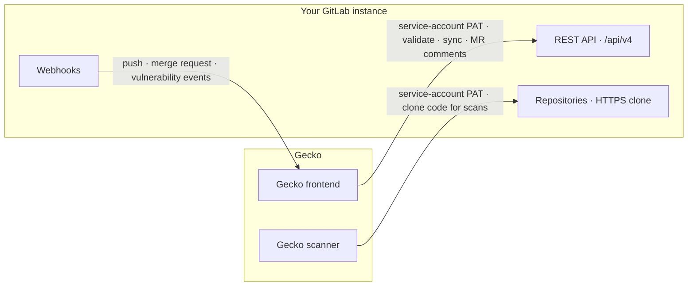
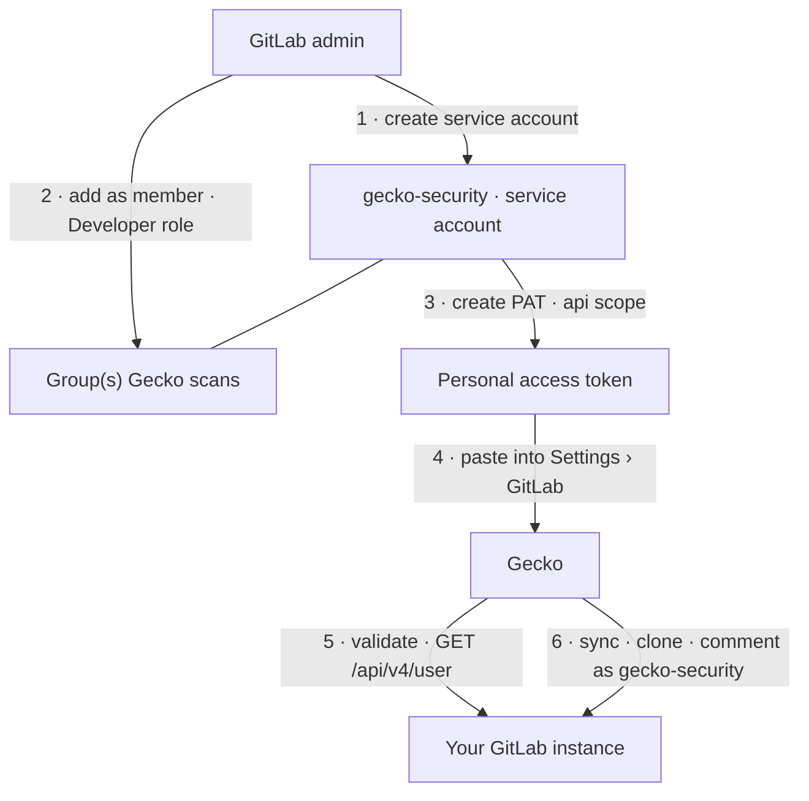
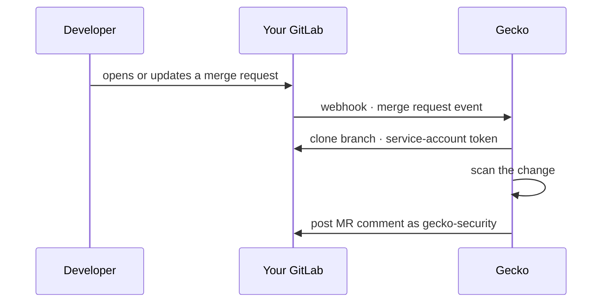

Self-managed GitLab lives inside your network perimeter and under your
identity policies. Connecting it to Gecko is an **admin-led rollout**, not a
quick token paste. It has three parts:

1. **Scanning identity.** A dedicated **service account with a personal
   access token (PAT)** owns the integration, instead of an employee's
   account.
2. **Network.** Gecko's IP addresses are allowlisted wherever your instance
   enforces IP access. The allowlist must be in place **before you connect**,
   or everything fails with a valid token.
3. **User linking.** An **OAuth application registered on your instance**
   lets each dashboard user link their own GitLab account, which is what
   their repository visibility in Gecko is derived from. See
   [Who sees what in Gecko](#who-sees-what-in-gecko).

| At a glance | |
| --- | --- |
| **Who you need** | A GitLab instance admin (or top-level group Owner) and a Gecko admin |
| **What you'll create** | A service account, a PAT with the `api` scope, a group webhook, and an OAuth application for user linking |
| **Time** | About 30 minutes of configuration, plus lead time for any firewall change |
| **When you're done** | Repos sync, a scan completes, and a test MR gets a Gecko comment. See [Verify the rollout](#verify-the-rollout) |

<Note>
  On GitLab.com? None of this applies. See
  [Connect GitLab](/connect/gitlab) for the lightweight cloud setup.
</Note>

## How the integration works

Two Gecko components talk to your instance, and your instance sends events
back to Gecko. All three paths matter: if one is blocked, you get partial,
confusing failures.



Everything Gecko does in GitLab is attributed to the account that owns the
token. That makes the account choice the first decision of the rollout.

## Why a service account

A service account is a machine user that exists only for the Gecko
integration. Compared to a token on an employee's account:

1. **It survives offboarding.** If the engineer who connected Gecko leaves and
   their account is deactivated, an integration on their token breaks. A
   service account doesn't.
2. **It scopes cleanly.** The service account is a member of exactly the groups
   Gecko should scan, nothing else. An employee token carries every permission
   that person has.
3. **Attribution is obvious.** MR comments and fix MRs appear as
   `gecko-security`, not as a random teammate. Reviewers always know which
   activity is Gecko's.
4. **Rotation is routine.** Rotating the PAT is a scheduled task, not an
   interruption to someone's personal credentials.

## The access model



The service account's group membership is the permission boundary: Gecko can
only see and clone what the service account can see and clone. The
**Developer** role is enough. It can read code, comment on merge requests, and
push fix branches. Nothing above Developer is needed.

## Admin setup

<Steps>
<Step title="Create the service account">
  On GitLab Premium/Ultimate, an instance administrator can create a
  [service account](https://docs.gitlab.com/user/profile/service_accounts/)
  (a bot-type user that doesn't consume a license seat on Ultimate). On other
  tiers, create a regular user account reserved for the integration, for
  example `gecko-security`, with a shared-mailbox email your team controls.
</Step>

<Step title="Add it to the groups Gecko should scan">
  In each top-level group that contains repositories you want scanned, go to
  **Manage** &gt; **Members**, invite the service account, and give it the
  **Developer** role. Membership at the group level covers all projects and
  subgroups beneath it.
</Step>

<Step title="Create the PAT as the service account">
  Create a personal access token **on the service account**:

  - **Name**: `Gecko Security`
  - **Expiration**: your standard rotation window (GitLab requires an
    expiration date unless an administrator has changed that policy)
  - **Scope**: `api`. This is the only scope needed.
    [Token scopes in detail](#token-scopes-in-detail) lists every call Gecko
    makes with it.

  On Premium/Ultimate, admins can create service-account tokens directly from
  the Admin area or the
  [service accounts API](https://docs.gitlab.com/api/service_accounts/)
  without signing in as the account.

  <Warning>
    Double-check you are creating the token on the **service account**, not on
    your own account. A token created while signed in as yourself carries your
    permissions and breaks when your account is offboarded.
  </Warning>
</Step>

<Step title="Allowlist Gecko's IP addresses">
  Most self-managed instances restrict access by IP somewhere: the instance,
  a group, or a firewall. If yours does, add Gecko's three IP addresses
  **before** connecting. See
  [Network and IP allowlist](#network-and-ip-allowlist) below.
</Step>

<Step title="Connect in Gecko">
  Go to **Settings** &gt; **GitLab** and enter your instance's base URL, for
  example `https://gitlab.example.com`, and the service account's token. Use
  the base URL only, without `/api/v4`. The instance must be reachable over
  HTTPS with a valid certificate. Gecko rejects instance URLs that aren't
  HTTPS or that point at private or loopback addresses.
</Step>

<Step title="Select repositories">
  Gecko syncs every project the service account can access. If a repository is
  missing, the service account isn't a member of its group. Fix the membership
  in GitLab and re-sync.
</Step>

<Step title="Configure the webhook">
  Gecko shows a webhook URL and a secret token. Add it at the **group** level
  (**Settings** &gt; **Webhooks** on the group; available on Premium/Ultimate)
  so new projects are covered automatically, or per project on other tiers.
  Enable **Merge request events**, **Push events**, and **Vulnerability
  events**, and put the secret in **Secret token**.

  Webhooks are outbound HTTPS from your instance to `app.gecko.security`, so
  they usually need no inbound firewall change. Your instance does need to be
  able to reach the internet. See [Webhooks](/connect/webhooks).
</Step>
</Steps>

## Verify the rollout

Each check isolates a different layer. Run them in order: if one fails, you
know exactly which part of the setup to revisit.

<Steps>
<Step title="Test the token itself">
  From a machine inside your network:

  ```bash
  curl --header "PRIVATE-TOKEN: <service-account-token>" \
    https://gitlab.example.com/api/v4/user
  ```

  A `200` whose `username` is the service account confirms the PAT is valid
  and belongs to the right account. A `401` means the token is wrong. A
  response showing **your** username means the token was created on the wrong
  account.

  <Note>
    This test runs from inside your network, so it says nothing about the IP
    allowlist. A token that passes here but fails in Gecko is almost always a
    network restriction, not a credential problem.
  </Note>
</Step>

<Step title="Confirm each path from Gecko">
  1. **The repository list populates** in Gecko. This confirms the frontend
     IPs are allowed and the service account's memberships are right.
  2. **A [baseline scan](/scanning/run-a-scan) completes.** This confirms the
     scanner IP is allowed and clones work.
  3. **A test merge request gets a Gecko comment.** Open a draft MR touching
     any file. A comment from `gecko-security` confirms the webhook delivers
     and the `api` scope works. If nothing appears, check the webhook's
     **Recent events** in GitLab for the delivery status.
</Step>
</Steps>

## What happens on every merge request

Once connected, the day-to-day flow is fully automatic:



The developer never leaves GitLab. Findings arrive as MR comments from the
service account, and [auto-fix MRs](/remediation/auto-fix-prs) are opened by
the same account.

## Who sees what in Gecko

Two GitLab identities are involved, with strictly separate jobs:

- **The service account scans.** Its memberships decide which repositories
  exist in Gecko at all, and it authors every MR comment and fix MR.
- **Each user's own GitLab account decides what they see.** Dashboard users
  link their GitLab account to their Gecko user (read-only, see below), and
  Gecko shows them only the synced repositories their GitLab user can
  access. GitLab's permissions stay the single source of truth; SSO and
  SAML assertions play no part in repository access.
- **Roles cap actions.** A [Gecko role](/teams-permissions) decides whether
  someone can run scans or change settings, not which repositories appear.
- **Developers don't need Gecko accounts.** Findings arrive as MR comments
  from the service account, inside GitLab.

The full picture is on [How identity works in Gecko](/access/identity-model).

## Enable user linking

Gecko can't pre-register an OAuth application on your server, so an admin
registers one once; after that, every user links through it.

<Steps>
<Step title="Get the redirect URI from Gecko">
  In Gecko, go to **Settings** &gt; **GitLab** &gt; **User account linking**
  and copy the **redirect URI**.
</Step>

<Step title="Register the application on your instance">
  Go to **Admin area** &gt; **Applications** &gt; **New application** (an
  instance-wide application, so every user can link):

  - **Name**: `Gecko Security`
  - **Redirect URI**: the URI you copied from Gecko
  - **Confidential**: enabled
  - **Scopes**: `read_api` only. User links are read-only; all writes run on
    the service account's PAT.
</Step>

<Step title="Add the credentials in Gecko">
  Copy the generated **Application ID** and **Secret** into
  **Settings** &gt; **GitLab** &gt; **User account linking** and save.
</Step>
</Steps>

### Users: link your account

Each dashboard user then goes to **Settings** &gt; **Sign-in methods** &gt;
**Connect GitLab**, signs in to your instance, and approves the request.
Their visible repositories appear immediately. The exact OAuth flow and the
endpoints it touches are on
[How identity works in Gecko](/access/identity-model#gitlab-account-linking).

## Network and IP allowlist

Self-managed GitLab and GitLab Dedicated usually **restrict access by IP**. If
yours does, allowlist Gecko's three IP addresses (one scanner, two frontend)
**before** you connect. Otherwise token validation, repo sync, and clones all
fail even with a valid token.

<Steps>
<Step title="Confirm prerequisites">
  Your instance must be reachable over **HTTPS** with a valid certificate, and
  you need access to wherever IP access is enforced (GitLab settings, Switchboard,
  or your firewall). Get Gecko's current IP addresses from your Gecko account
  contact; the canonical list lives on
  [Network & IP allowlist](/connect/network-allowlist#ip-addresses-to-allow).
</Step>

<Step title="Add the addresses where GitLab enforces IP access">
  <AccordionGroup>
    <Accordion title="Self-managed: group IP restriction">
      **Settings** &gt; **General** &gt; **Permissions and group features** &gt;
      **Restrict access by IP address**. Enter each address in CIDR notation
      (for example, `203.0.113.5/32`). See
      [GitLab group access and permissions](https://docs.gitlab.com/user/group/access_and_permissions/).
    </Accordion>
    <Accordion title="GitLab Dedicated: Switchboard allowlist">
      In Switchboard, open **Configuration** &gt; **IP allowlist** and add each
      address. See
      [GitLab Dedicated network security](https://docs.gitlab.com/administration/dedicated/configure_instance/network_security/).
    </Accordion>
    <Accordion title="Behind a firewall or load balancer">
      If a firewall, proxy, or load balancer sits in front of your instance,
      allow inbound HTTPS from the three addresses there. For the NLB-vs-ALB
      source-IP details, see
      [Network & IP allowlist](/connect/network-allowlist#behind-a-load-balancer).
    </Accordion>
  </AccordionGroup>
</Step>

<Step title="Verify">
  A populated repository list confirms the **frontend** addresses are allowed;
  a successful scan confirms the **scanner** address is allowed. Allow all three;
  a partial allowlist causes confusing, partial failures.
</Step>
</Steps>

## GitLab Dedicated

GitLab Dedicated follows the same model as self-managed (a dedicated service
account with a PAT) with one difference: IP access is enforced in
**Switchboard**, GitLab's management console for Dedicated tenants. Use your
tenant URL as the instance URL and add Gecko's IP addresses under
**Configuration** &gt; **IP allowlist** in Switchboard before connecting.

## Token scopes in detail

Select a single scope on the PAT: **`api`**. Below is the complete inventory
of what Gecko actually calls with it. If an operation isn't listed here,
Gecko doesn't perform it.

**Read operations** (would be covered by `read_api` + `read_repository`
alone):

| Operation | Purpose |
| --- | --- |
| `GET /api/v4/user` | Validate the token when you connect |
| `GET /api/v4/projects?membership=true` | Sync the repository list |
| `GET /api/v4/projects/:id` | Project metadata (default branch, visibility) |
| `GET /api/v4/projects/:id/repository/branches` | Branch list for scan targets |
| `GET /api/v4/projects/:id/languages` | Language breakdown shown in the dashboard |
| `GET /api/v4/projects/:id/repository/commits` | Commit metadata for scanned revisions |
| `GET /api/v4/projects/:id/merge_requests/:iid` and `.../diffs` | MR details and changed files for PR checks |
| `git clone` / `git fetch` over HTTPS | Pull code for the duration of a scan |

**Write operations** (the reason the scope must be `api`):

| Operation | Purpose | Triggered by |
| --- | --- | --- |
| `POST /api/v4/projects/:id/merge_requests/:iid/notes` | Post findings as MR comments | [PR checks](/scanning/pr-checks) |
| `POST /api/v4/projects/:id/repository/branches` + `git push` | Create the fix branch | [Auto-fix MRs](/remediation/auto-fix-prs) |
| `POST /api/v4/projects/:id/merge_requests` | Open the fix MR | [Auto-fix MRs](/remediation/auto-fix-prs) |
| `POST /api/graphql` (`vulnerabilityCreate`) | Push findings to your Security Dashboard | [Vulnerability export](/gitlab-vulnerability-export), only if enabled |

The writes are all API calls, and `api` is the only GitLab scope that grants
write access to the API. `write_repository` covers `git push` but not API
calls, so it can't replace it. Since `api` is a superset of `read_api` and
`read_repository`, select `api` alone.

The write operations map one-to-one to optional features. A team that doesn't
enable auto-fix MRs or vulnerability export will only ever see MR comments in
the write column.

<Tip>
  Don't take this list on trust. Every call Gecko makes is attributed to the
  service account, so you can filter your instance's API logs
  (`api_json.log`) or audit events by the `gecko-security` username and
  compare what you see against this inventory. It also makes a good baseline
  for an alert on unexpected activity from the account.
</Tip>

Just as important for a security review, what Gecko does **not** need:

- **No `sudo` or `admin_mode`.** Gecko never impersonates users or touches
  instance administration.
- **No instance-wide access.** The blast radius of the token is bounded by
  the service account's group memberships and its **Developer** role, not by
  the scope.

<Note>
  Want a read-only trial first? A PAT with `read_api` + `read_repository`
  lets Gecko sync and scan, but MR comments, fix MRs, and vulnerability
  export will fail with `403` until you switch to an `api`-scoped token.
</Note>

### What limits the token

GitLab [token scopes](https://docs.gitlab.com/user/profile/personal_access_tokens/#personal-access-token-scopes)
are a fixed list with no sub-scopes, so `api` is the smallest scope that
covers the write operations above. The real limits on the token are the two
axes you control:

- **Membership.** The service account sees only the groups and projects you
  add it to. Add it to specific projects instead of a top-level group if only
  a subset should be scannable, or use a
  [group access token](https://docs.gitlab.com/user/group/settings/group_access_tokens/),
  whose bot user is confined to its group by construction.
- **Role.** GitLab enforces the **Developer** role on every call, regardless
  of scope. The token can't push to protected branches, change settings or
  webhooks, manage members, delete projects, or act as another user.

## Rotate or revoke access

- **Rotate**: create a new PAT on the service account and paste it into
  **Settings** &gt; **GitLab**. Repository selection, scan history, and
  findings are unchanged. Rotation is a paste, not a re-setup. Put the
  expiration date on your team's rotation calendar; when the PAT expires,
  syncs, scans, and MR comments stop until a new token is added.
- **Revoke**: revoking the PAT in GitLab cuts off all of Gecko's access to
  your instance immediately. API calls and clones both fail from that moment.
  Delete the webhook to stop event delivery too. This is your kill switch, and
  it's entirely on your side.

## For your security team

The questions a security review usually asks, answered up front:

1. **What can Gecko access?** Exactly what the service account can access.
   Its group memberships are the permission boundary, and the **Developer**
   role is the ceiling. No instance-wide or admin access is ever required.
2. **Who can see the findings?** Members of the Gecko team, each scoped by
   their own GitLab permissions: a user sees a synced repository only if
   their [linked GitLab account](#enable-user-linking) can access it, and
   [Gecko roles](/teams-permissions) cap what they can do about it. SSO and
   SAML assertions play no part in repository access. See
   [How identity works in Gecko](/access/identity-model).
3. **What leaves our network?** Code is cloned over HTTPS for the duration of
   a scan and not retained. Gecko stores findings with minimal metadata:
   repository names, usernames/emails, and short (~5–6 line) code snippets.
   See [Architecture](/deployment/architecture).
4. **Where does traffic come from?** All access to your instance originates
   from three static IP addresses, so your allowlist stays small and auditable.
   Webhooks are outbound from your instance and verified by Gecko with a
   shared secret (`X-Gitlab-Token`).
5. **How do we revoke access?** Revoke the PAT. See
   [Rotate or revoke access](#rotate-or-revoke-access). Revocation is
   instant and controlled entirely from your side.
6. **What if code can't leave our network at all?** Gecko supports a
   [hybrid deployment](/deployment/hybrid) where scanning runs inside your own
   cloud account.

## Export findings back to GitLab

Gecko can push findings into GitLab's native Security Dashboard. See
[GitLab vulnerability export](/gitlab-vulnerability-export).

## Troubleshooting

Start from the symptom. Each one points at a different layer:

| Symptom | Most likely cause | Fix |
| --- | --- | --- |
| Token validation fails in Gecko, but the `curl` test passes inside your network | IP restriction | [Allowlist Gecko's addresses](#network-and-ip-allowlist) |
| Token validation fails everywhere (`401`) | Expired or revoked PAT | Create a new PAT on the service account |
| Repository list is empty or missing repos | Service account isn't a member of the group | Add it with the **Developer** role and re-sync |
| Repos sync but scans fail to clone | Scanner IP not allowed (frontend IPs are) | Allow all three addresses, not just some |
| MR comments fail with `403` | Missing `api` scope, or role below Developer | Recreate the token with `api`; check membership |
| PR checks never trigger | Webhook not delivering | Check **Recent events** on the webhook; confirm the secret and that your instance can reach `app.gecko.security` |

<AccordionGroup>
  <Accordion title="Token validation fails">
    Confirm the PAT is active, has the `api` scope, and that Gecko's IP addresses
    can reach your instance. See [Network & IP allowlist](/connect/network-allowlist).
  </Accordion>
  <Accordion title="Empty repository list or clone failures">
    Usually an IP restriction. A valid token still can't help if the network
    blocks Gecko. Allowlist the IP addresses and retry the sync. If only some
    repositories are missing, the service account isn't a member of their
    group. Add it with the Developer role.
  </Accordion>
  <Accordion title="MR comments fail with 403">
    The PAT is missing the `api` scope, or the service account's role on the
    project is below Developer. Recreate the token with `api` and confirm the
    membership.
  </Accordion>
  <Accordion title="PR checks don't trigger">
    The webhook isn't reaching Gecko. Check the webhook's **Recent events** in
    GitLab for delivery failures, confirm the secret token matches, and make
    sure your instance can reach `app.gecko.security` over HTTPS.
  </Accordion>
</AccordionGroup>

## FAQ

<AccordionGroup>
  <Accordion title="Why a PAT on a service account instead of OAuth?">
    Gecko uses both, for different jobs. Scanning is a team-level, non-human
    integration, and a service-account PAT fits that shape: it isn't bound to
    any person, it survives offboarding, your admin rotates and revokes it on
    your schedule, and every call it makes shows up in audit logs under one
    clearly named account. A GitLab OAuth token is the opposite by design: it
    is issued to whoever clicks "authorize", carries that person's
    permissions, and dies with their account. On a self-managed instance it
    would also put an extra admin step (registering an application on your
    instance) in front of the very first scan.

    If you're comparing with GitHub: the
    [Gecko GitHub App](/connect/github) gets installation-level identity and
    auto-rotating tokens from GitHub's app framework. GitLab has no
    equivalent framework for installable apps, so a dedicated service account
    with a PAT is the standard integration pattern on GitLab, not a Gecko
    shortcut.
  </Accordion>
  <Accordion title="Can one service account cover multiple top-level groups?">
    Yes. Add the same service account as a **Developer** member of each
    top-level group you want Gecko to scan. One account, one PAT, one
    connection.
  </Accordion>
  <Accordion title="What happens when the PAT expires?">
    Syncs, scans, and MR comments stop until a new token is pasted into
    **Settings** &gt; **GitLab**. Nothing else is lost. Align the PAT's
    expiration with your rotation calendar so it never expires by surprise.
  </Accordion>
  <Accordion title="We don't have Premium/Ultimate. Can we still do this?">
    Yes. Use a regular user account reserved for the integration instead of a
    GitLab service account, and add webhooks per project instead of at the
    group level. The model is identical; only the GitLab features differ.
  </Accordion>
  <Accordion title="Our instance can't be reached from the internet at all">
    The IP allowlist approach requires your instance to be reachable over
    HTTPS from Gecko's three addresses. If code can't leave your network under
    any conditions, look at the
    [hybrid deployment](/deployment/hybrid), where scanning runs inside your
    own cloud account.
  </Accordion>
  <Accordion title="Do developers need to do anything?">
    No. Once the admin setup is done, findings arrive as MR comments
    automatically, and developers act on them inside GitLab without a Gecko
    login. Only the people who work in the Gecko dashboard (security
    engineers, champions, admins) need Gecko accounts, and they
    [link their GitLab account](#enable-user-linking) to see their
    repositories. See [How identity works in Gecko](/access/identity-model).
  </Accordion>
</AccordionGroup>
