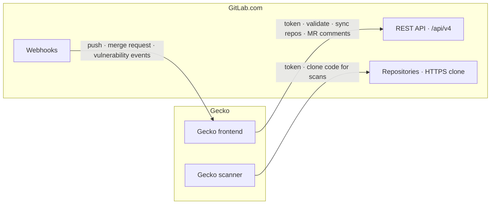

Gecko connects to GitLab.com with a **GitLab access token**. Gecko validates
the token, then uses it to list repositories, read project metadata, clone code
for scans, post merge-request comments, and open fix merge requests.

GitLab.com is a cloud service reachable from anywhere, so there is **no
network setup**: no IP allowlisting, no firewall changes, no admin rollout.
Connecting takes a few minutes.

<Note>
  Running GitLab on your own infrastructure or on GitLab Dedicated? That is a
  different setup with its own identity and network model. See
  [Connect self-managed GitLab](/connect/gitlab-self-managed).
</Note>

## Before you start

You need:

- **In GitLab**: an account with **Developer or higher** on the repositories
  you want to scan, and **Maintainer** on the project (or **Owner** on the
  group) to add the webhook. Webhook creation needs a higher role than the
  token does, and it's the step people usually get stuck on.
- **In Gecko**: admin access to **Settings**.

Setup takes about 10 minutes.

## How the integration works

Two Gecko components talk to GitLab.com, and GitLab sends events back to
Gecko:



1. **Gecko frontend → GitLab API.** Validates the token, syncs the repository
   list, reads branches and MR metadata, posts MR comments, opens fix MRs.
2. **Gecko scanner → GitLab.** Clones the selected repositories over HTTPS at
   scan time, authenticated with the same token.
3. **GitLab → Gecko.** Webhooks notify Gecko when code is pushed or a merge
   request opens or updates, so [PR checks](/scanning/pr-checks) run without
   polling.

## Connect

<Steps>
<Step title="Create an access token">
  In GitLab, create a personal access token, or, for production, a
  [group access token](https://docs.gitlab.com/user/group/settings/group_access_tokens/)
  so the connection survives if the person who set it up leaves:

  - **Name**: `Gecko Security`
  - **Expiration**: 1 year, or your team's standard rotation window
  - **Role**: Developer or higher on the target projects
  - **Scope**: `api`

  <Note>
    The `api` scope is required to post comments on merge requests. With a
    narrower scope, scans still run but MR comments fail with `403`.
  </Note>
</Step>

<Step title="Add the token in Gecko">
  Go to **Settings** &gt; **GitLab**, enter `https://gitlab.com` as the
  instance URL, and paste the token. Gecko validates it with
  `GET https://gitlab.com/api/v4/user`.
</Step>

<Step title="Select repositories">
  Gecko syncs the projects your token can access
  (`GET /api/v4/projects?membership=true`). Select the repositories you want
  Gecko to track.
</Step>

<Step title="Configure the webhook">
  Gecko shows a webhook URL and a secret token. In GitLab, go to **Settings**
  &gt; **Webhooks**, paste the URL, put the secret in **Secret token**, and
  enable **Merge request events**, **Push events**, and **Vulnerability
  events**. Gecko verifies the `X-Gitlab-Token` header on every delivery. See
  [Webhooks](/connect/webhooks).
</Step>
</Steps>

## Verify the connection

You're done when all three of these are true, in order:

1. **The repository list is populated** in Gecko. The token is valid and has
   the right memberships.
2. **A [baseline scan](/scanning/run-a-scan) completes** on one repository.
   Cloning works.
3. **A test merge request gets a Gecko comment.** The webhook and the `api`
   scope both work. Open a draft MR that touches any file, then check the
   webhook's **Recent events** in GitLab for a `200` if nothing appears.

## Who sees what

The token is a team-level credential: it decides which repositories exist in
Gecko and authors every MR comment. What each dashboard user **sees** is
personal: they link their own GitLab.com account from **Settings** &gt;
**Sign-in methods** &gt; **Connect GitLab** (Gecko's OAuth app on GitLab.com
is pre-registered, so there's nothing to configure), and Gecko shows them
only the synced repositories their GitLab user can access. The link is
read-only; their [role](/teams-permissions) caps what they can do.
Developers who just read MR comments never need a Gecko account. See
[How identity works in Gecko](/access/identity-model#gitlab-account-linking).

## What Gecko uses the token for

- Validate the connection: `GET /api/v4/user`
- List projects: `GET /api/v4/projects?membership=true`
- Read branches, languages, commits, and merge-request details
- Clone repositories over HTTPS for scan workers
- Post merge-request comments and open fix merge requests

## Export findings back to GitLab

Gecko can push findings into GitLab's native Security Dashboard. See
[GitLab vulnerability export](/gitlab-vulnerability-export).

## Troubleshooting

<AccordionGroup>
  <Accordion title="Token validation fails">
    Confirm the token is active and has the `api` scope. You can test it
    yourself:

    ```bash
    curl --header "PRIVATE-TOKEN: <your-token>" https://gitlab.com/api/v4/user
    ```

    A `200` with your account JSON means the token is fine; a `401` means it's
    expired or revoked.
  </Accordion>
  <Accordion title="Repositories aren't showing up">
    The token's account isn't a member of the project or group. Add it with
    the Developer role and re-sync.
  </Accordion>
  <Accordion title="MR comments fail with 403">
    The token is missing the `api` scope. Recreate it with `api` and reconnect.
  </Accordion>
</AccordionGroup>

## FAQ

<AccordionGroup>
  <Accordion title="What happens when the token expires?">
    Syncs, scans, and MR comments stop until you paste a fresh token in
    **Settings** &gt; **GitLab**. Your repository selection, scan history, and
    findings are unaffected. Rotation is a paste, not a re-setup.
  </Accordion>
  <Accordion title="Personal token or group token?">
    Personal tokens are the fastest way to evaluate Gecko. For production, use
    a group access token: it isn't tied to a person, so it survives
    offboarding, and its bot user shows up clearly in audit logs.
  </Accordion>
  <Accordion title="Does Gecko store our source code?">
    Code is cloned for the duration of a scan and not retained. Gecko stores
    findings with minimal metadata: repository names, usernames/emails, and
    short (~5–6 line) code snippets. See
    [Architecture](/deployment/architecture).
  </Accordion>
</AccordionGroup>
