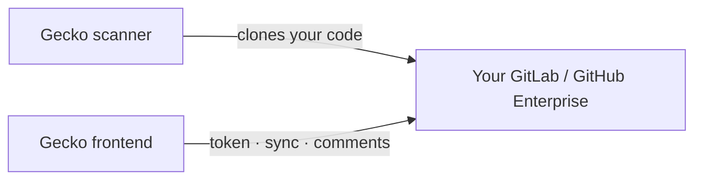

Most teams can skip this page. If you use GitHub.com or GitLab.com, Gecko
connects over the public internet and there's nothing to set up.

You need this only when your instance **restricts access by IP**, common with
self-managed GitLab, GitLab Dedicated, and GitHub Enterprise Server. In that
case, allow Gecko's IP addresses before you connect, or the connection will fail
even with a valid token.

## IP addresses to allow

Gecko reaches your instance from two systems: the **scanner**, which clones your
code, and the **frontend**, which talks to your instance's API. Allow all three
addresses:

| Gecko system | IP address | Used for |
| --- | --- | --- |
| **Scanner** | `<GECKO_SCANNER_IP>/32` | Cloning your repositories during scans |
| **Frontend** | `<GECKO_FRONTEND_IP_1>/32` | API calls, token validation, and merge-request comments |
| **Frontend** | `<GECKO_FRONTEND_IP_2>/32` | Same, plus a second address for high availability |

<Warning>
  These values are placeholders. Get the current addresses from your Gecko account contact before you apply them. They're
  stable, but confirm them whenever you tighten your firewall.
</Warning>

## Where to add them

Add all three addresses wherever your access policy is enforced:

<AccordionGroup>
  <Accordion title="GitLab group IP restriction">
    **Settings** &gt; **General** &gt; **Permissions and group features** &gt;
    **Restrict access by IP address**. Enter each address in CIDR notation
    (for example, `203.0.113.5/32`). See
    [GitLab group access and permissions](https://docs.gitlab.com/user/group/access_and_permissions/).
  </Accordion>
  <Accordion title="GitLab Dedicated IP allowlist">
    In Switchboard, open **Configuration** &gt; **IP allowlist** and add each
    address. See
    [GitLab Dedicated network security](https://docs.gitlab.com/administration/dedicated/configure_instance/network_security/).
  </Accordion>
  <Accordion title="Corporate firewall or reverse proxy">
    If a firewall, WAF, or proxy sits in front of your instance, allow inbound
    HTTPS from the three addresses to your API and Git-over-HTTPS endpoints.
  </Accordion>
  <Accordion title="Cloud security group">
    If your instance runs in a cloud network, add the three addresses to the
    inbound rules that guard port 443.
  </Accordion>
</AccordionGroup>

## What each address does

Gecko reaches your instance for two jobs, which is why a partial allowlist
causes confusing, partial failures:

- **Scanner**: Gecko clones your repositories to analyze them.
- **Frontend**: Gecko validates your token, syncs your repository list, and
  posts merge-request comments.

If you allow the scanner address but not the frontend addresses, scans can clone
but the connection won't validate, and vice versa. Allow all three.

## Webhooks go the other way

Webhooks travel **from** your instance **to** Gecko at `app.gecko.security`.
That's ordinary outbound traffic from your network, so it usually needs no
inbound rule, but your instance must be able to reach `app.gecko.security` over
HTTPS. See [Webhooks](/connect/webhooks).

## Verify

After you add the addresses, reconnect in Gecko:

- A successful connection and a populated repository list confirm the
  **frontend** addresses are allowed.
- A successful scan confirms the **scanner** address is allowed.

## Troubleshooting

<AccordionGroup>
  <Accordion title="The token is valid but the connection won't validate">
    The frontend addresses are likely blocked. Confirm both are in your allowlist.
  </Accordion>
  <Accordion title="The connection works but scans can't clone">
    The scanner address is likely blocked. Add it and rescan.
  </Accordion>
  <Accordion title="It works intermittently">
    You probably allowed only one of the two frontend addresses. Both are used
    for high availability; add both.
  </Accordion>
</AccordionGroup>
