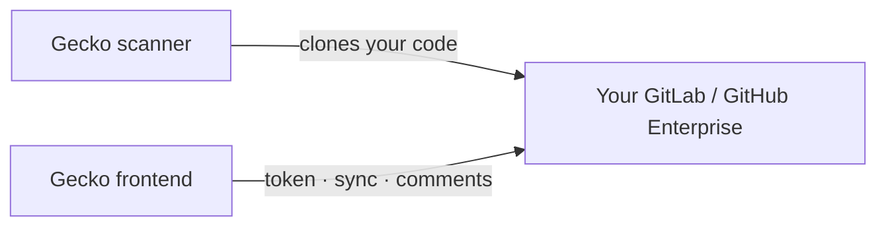

Most teams can skip this page. If you use GitHub.com or GitLab.com, Gecko
connects over the public internet and there's nothing to set up.

You need this only when your instance **restricts access by IP**, common with
self-managed GitLab, GitLab Dedicated, and GitHub Enterprise Server. In that
case, allow Gecko's IP addresses before you connect, or the connection will fail
even with a valid token.

This page is the canonical list of Gecko's addresses and the general ways to
allow them. For the GitLab-specific walkthrough (group IP restriction, GitLab
Dedicated, Switchboard), see [Connect GitLab](/connect/gitlab#network-and-ip-allowlist-self-managed).

Allowlisting Gecko's static IPs keeps your instance private: you expose a small,
controlled surface area, only Gecko's known addresses can reach it, and you keep
your existing infrastructure with no migration. For most teams it's under an
hour of network configuration.

## Prerequisites

Before you start, make sure you have:

- An instance reachable over **HTTPS** with a valid TLS certificate.
- Access to wherever your access policy is enforced: your Git provider's IP
  restriction settings, a corporate firewall or reverse proxy, or a cloud
  security group.
- **Gecko's static IP addresses.** Get the current values from your Gecko
  account contact before you apply them.

## IP addresses to allow

Gecko reaches your instance from two systems: the **scanner**, which clones your
code, and the **frontend**, which talks to your instance's API. Allow all three
addresses:

| Gecko system | IP address | Used for |
| --- | --- | --- |
| **Scanner** | `<GECKO_SCANNER_IP>/32` | Cloning your repositories during scans |
| **Frontend** | `<GECKO_FRONTEND_IP_1>/32` | API calls, token validation, and merge-request comments |
| **Frontend** | `<GECKO_FRONTEND_IP_2>/32` | Same, plus a second address for high availability |

<Warning>
  These values are placeholders. Get the current addresses from your Gecko account contact before you apply them. They're
  stable, but confirm them whenever you tighten your firewall.
</Warning>

## Where to add them

Add Gecko's three addresses wherever your access policy is enforced. If you're
on self-managed GitLab or GitLab Dedicated, follow the GitLab-specific steps in
[Connect GitLab](/connect/gitlab#network-and-ip-allowlist-self-managed). For
everything else:

<AccordionGroup>
  <Accordion title="GitHub Enterprise Server">
    Allow inbound HTTPS from the three addresses to your instance, wherever you
    enforce IP access (instance-level allowlist, firewall, or load balancer).
  </Accordion>
  <Accordion title="Corporate firewall or reverse proxy">
    If a firewall, WAF, or proxy sits in front of your instance, allow inbound
    HTTPS from the three addresses to your API and Git-over-HTTPS endpoints.
  </Accordion>
  <Accordion title="Cloud security group">
    If your instance runs in a cloud network, add the three addresses to the
    inbound rules that guard port 443.
  </Accordion>
</AccordionGroup>

### Behind a load balancer

If Gecko needs to reach several internal services, you can put one load balancer
in front of them and allowlist Gecko's addresses there instead of on each
backend. How you filter depends on the load balancer type:

| Load balancer | Layer | Source IP | Where to allowlist |
| --- | --- | --- | --- |
| **Network (NLB)** | Layer 4 (TCP) | Preserved — backends see Gecko's real source IP | At the NLB, or on backends using the original IP |
| **Application (ALB)** | Layer 7 (HTTP) | Rewritten via NAT — backends see the load balancer's IP | On backends using `X-Forwarded-For`, since the source IP is no longer Gecko's |

An NLB is usually simpler: because it preserves the source IP, you can filter
directly at the load balancer and your backends still see Gecko's real address.
Create the load balancer, allowlist Gecko's static IPs, and publish a DNS record
that points your instance URL at it.

## What each address does

Gecko reaches your instance for two jobs, which is why a partial allowlist
causes confusing, partial failures:

- **Scanner**: Gecko clones your repositories to analyze them.
- **Frontend**: Gecko validates your token, syncs your repository list, and
  posts merge-request comments.

If you allow the scanner address but not the frontend addresses, scans can clone
but the connection won't validate, and vice versa. Allow all three.

## Webhooks go the other way

Webhooks travel **from** your instance **to** Gecko at `app.gecko.security`.
That's ordinary outbound traffic from your network, so it usually needs no
inbound rule, but your instance must be able to reach `app.gecko.security` over
HTTPS. See [Webhooks](/connect/webhooks).

## Verify

After you add the addresses, reconnect in Gecko:

- A successful connection and a populated repository list confirm the
  **frontend** addresses are allowed.
- A successful scan confirms the **scanner** address is allowed.

<Tip>
  Test connectivity from a host outside your network before you connect in
  Gecko. If an external client can't reach your instance over HTTPS, Gecko
  won't either — and you'll have ruled out the allowlist as the cause.
</Tip>

## Best practices

- Serve your instance over **HTTPS with a valid certificate** — Gecko rejects
  non-HTTPS instance URLs and those pointing at private or loopback addresses.
- Use a **dedicated service account** for the connection so access is easy to
  audit and revoke.
- **Monitor access logs** for Gecko's addresses to confirm expected traffic.
- **Re-confirm the addresses** with your Gecko contact whenever you tighten your
  firewall, and review the allowlist during regular security audits.

## Troubleshooting

<AccordionGroup>
  <Accordion title="The token is valid but the connection won't validate">
    The frontend addresses are likely blocked. Confirm both are in your allowlist.
  </Accordion>
  <Accordion title="The connection works but scans can't clone">
    The scanner address is likely blocked. Add it and rescan.
  </Accordion>
  <Accordion title="It works intermittently">
    You probably allowed only one of the two frontend addresses. Both are used
    for high availability; add both.
  </Accordion>
  <Accordion title="Behind a load balancer, traffic is still blocked">
    If you use an ALB, your backends see the load balancer's IP rather than
    Gecko's. Filter on `X-Forwarded-For`, or switch to an NLB to preserve
    Gecko's source IP.
  </Accordion>
</AccordionGroup>
