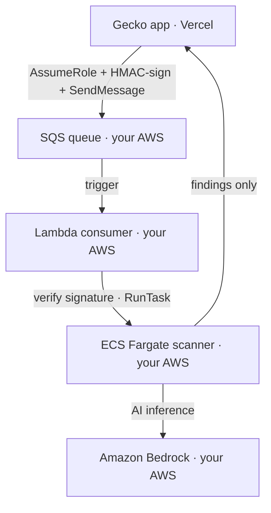

In a hybrid deployment, the **scanner, S3 storage, and all AI inference run inside
your AWS account**. Gecko hosts only the dashboard, database, and scan
orchestration. This page covers the **assume-role** model, where Gecko reaches into
your account by assuming a single, narrowly-scoped IAM role.

<Info>
  **You'll need:** Gecko **Enterprise** with hybrid enabled for your team, AWS
  admin access to run Terraform, and the ability to publish a container image to a
  private ECR repository. The **Deployment** settings page appears in Gecko once the
  feature is enabled; ask the Gecko team to turn it on.
</Info>

## How it works

Ingress is **one-directional and queue-based**. Gecko never opens an inbound
connection to your account. It assumes a role, signs a job, and drops it on your SQS
queue; everything after that runs inside your account and reaches *out* to Gecko to
post findings.



Two security properties hold by design:

- **Gecko's trust is pinned to one exact principal**, gated by a shared **ExternalId**
  (a confused-deputy guard). A leaked role ARN alone grants nothing.
- **A leaked queue URL alone cannot launch a scan.** Every message is HMAC-signed by
  Gecko and re-verified by the Lambda before any compute starts.

## Who hosts what

<Columns cols={2}>
  <Card title="Gecko cloud" icon="server">
    Dashboard, Postgres, SSO/Auth, scan orchestration. Stores your GitHub
    credential and minimal metadata only (repo names, usernames/emails, ~5–6 line
    snippets).
  </Card>
  <Card title="Your AWS account" icon="aws">
    SQS queue + DLQ, S3 artifact bucket, ECS Fargate scanner, the SQS-consumer
    Lambda, and all AI inference via Bedrock. Your source code stays in your
    account.
  </Card>
</Columns>

## What the Terraform provisions

The `gecko-blackstone` Terraform module (versioned; pin to a release, e.g.
`gecko-blackstone-v1.0`) creates everything in **your** account:

| Resource | Purpose |
| --- | --- |
| **SQS queue + DLQ** | Receives scan jobs; failed messages redrive to the DLQ after 3 attempts |
| **S3 bucket** | Stores uploaded repository archives (encrypted, private, TLS-only) |
| **ECS Fargate cluster + task** | Runs the scanner container, pulled from Gecko's public ECR |
| **Lambda consumer** | Verifies each message's signature, then starts one ECS task per scan |
| **SSM SecureStrings** | Store the SQS message secret and the scanner callback secret |
| **CloudWatch log groups** | Lambda and scanner logs |
| **Four IAM roles** | See [Roles](#the-four-iam-roles) below |

<Note>
  There's **no image to build or publish.** The scanner image ships from **Gecko's
  public ECR**, and the module presets `scanner_image_url` to it, so ECS pulls it
  directly. To run your own mirror instead, see [Use your own image
  registry](#use-your-own-image-registry-optional).
</Note>

### The four IAM roles

| Role | Trusted by | Can do (and nothing else) |
| --- | --- | --- |
| **`gecko-sender`** | Gecko's exact prod IAM user, gated by ExternalId | `SendMessage` to the queue; `PutObject` under `uploads/*` only |
| **Lambda consumer role** | Lambda | Read/delete queue messages; read the HMAC secret; `RunTask` on this cluster; pass only the two task roles |
| **Task execution role** | ECS | Pull the image, write logs, read the callback secret |
| **Scanner task role** | ECS | Invoke Bedrock models; read/write scan artifacts |

## Values: who provides what

<Tabs>
  <Tab title="Gecko provides">
    | Variable | What it is |
    | --- | --- |
    | `gecko_aws_principal_arn` | Gecko's **exact** prod IAM user ARN (e.g. `arn:aws:iam::767212035446:user/gecko-prod`). Trust this exactly; **not** account root. |
    | `internal_api_secret` | Callback secret the scanner uses to post results back to Gecko. |
    | `scanner_image_url` | Preset to Gecko's **public ECR** scanner image; ECS pulls it directly. Override only to use your own mirror. |
    | `frontend_base_url` | Defaults to `https://app.gecko.security`. Only override for a non-prod Gecko. |
  </Tab>
  <Tab title="You generate">
    | Variable | How to produce it |
    | --- | --- |
    | `sts_external_id` | `openssl rand -hex 16`. Gecko must store the **same** value; agree on it out-of-band. |
    | `sqs_message_secret` | `openssl rand -hex 32` (must be 64 lowercase hex chars). Gecko signs every message with this. |
    | `scan_artifacts_bucket_name` *(optional)* | Set only if your org mandates a pre-approved name; otherwise auto-named `gecko-<account-id>-scan-artifacts`. |
    | `scanner_task_cpu` / `scanner_task_memory` *(optional)* | Sizing; the example ships 16 vCPU / 32 GB for real workloads. |
  </Tab>
</Tabs>

<Warning>
  `terraform.tfvars` is gitignored, but these secrets land in **Terraform state in
  plaintext**. Use an encrypted, access-controlled remote backend, or treat the state
  file as a secret.
</Warning>

## Set it up

<Steps>
<Step title="Apply the Terraform">
  Download and unpack the versioned module (for example `gecko-blackstone-v1.0`),
  then apply it from that directory:

  ```bash
  cd gecko-blackstone-v1.0
  cp terraform.tfvars.example terraform.tfvars
  # Fill in: gecko_aws_principal_arn, sts_external_id,
  #          sqs_message_secret, internal_api_secret

  terraform init
  terraform plan    # confirm: 4 roles, queue + DLQ, bucket, ECS, Lambda
  terraform apply
  ```

  ECS pulls the scanner image straight from Gecko's public ECR, so there's no image
  step, once the apply completes, the infrastructure is ready.
</Step>

<Step title="Hand the config back to Gecko">
  The module emits exactly the shape the dashboard expects:

  ```bash
  terraform output -json gecko_deployment_config
  ```

  ```json
  {
    "kind": "blackstone_sqs",
    "sqsQueueUrl": "https://sqs.us-east-1.amazonaws.com/.../gecko-scan-requests",
    "sqsRegion": "us-east-1",
    "roleArn": "arn:aws:iam::<your-account>:role/gecko-sender",
    "externalId": "<the sts_external_id>",
    "sqsMessageSecret": "<the 64-char hex>",
    "s3Url": "s3://gecko-<your-account>-scan-artifacts",
    "s3Region": "us-east-1"
  }
  ```

  This output is **sensitive** (it contains the ExternalId and HMAC secret), share it
  over a secure channel. Either Gecko enters it for your team, or you enter it yourself
  next.
</Step>

<Step title="Configure the dashboard">
  In Gecko, go to **Settings > Deployment** and set, in order:

  1. **Authentication →** select **Assume role**.
  2. **Queue:** Queue URL → `sqsQueueUrl`; Signing secret → `sqsMessageSecret`
     (must be 64 lowercase hex chars or it won't save); Region → `sqsRegion`.
  3. **Cross-account access:** IAM role ARN → `roleArn`; External ID → `externalId`
     (must match the role's trust policy exactly).
  4. **Storage:** S3 URL → `s3Url`; Region → `s3Region`.

  Settings **auto-save** once every required field is valid; there's no Save button.
  Watch the **Status** line change to *Connected*.
</Step>

<Step title="Test the connection">
  Click **Test connection**. Gecko assumes the role and sends a signed test message;
  the Lambda verifies the signature and **intentionally skips starting a task** for
  tests. A green result means the full chain works: AssumeRole → SendMessage → receive
  → signature verify.
</Step>

<Step title="Run your first scan">
  Connect GitHub under **Settings > Git**, then start a scan with **+ New Scan**. Watch
  it flow through your account:

  ```bash
  aws logs tail /aws/lambda/gecko-sqs-consumer --follow   # message received + RunTask
  aws logs tail /ecs/gecko-scanner --follow               # download + scanner run
  ```

  Findings appear in the dashboard under **Scans**, **Repositories**, and
  **Vulnerabilities**.
</Step>
</Steps>

## Troubleshooting

| Symptom | Likely cause |
| --- | --- |
| Deployment page redirects to Settings | Hybrid not enabled for your team, or you lack the deployment-manage permission. Ask Gecko. |
| Signing secret won't save | It must be exactly 64 lowercase hex chars (`openssl rand -hex 32`). |
| Settings won't auto-save | In assume-role mode, **both** role ARN and external ID are required, plus queue URL, a valid signing secret, and S3 URL. |
| Test fails at AssumeRole | `gecko_aws_principal_arn` or `sts_external_id` mismatch between the role's trust policy and Gecko's stored config. |
| Test fails after AssumeRole | Wrong queue URL/region, or the dashboard signing secret ≠ the one in SSM. |
| Messages arrive but no task starts | Check the Lambda logs: signature verification failing (secret mismatch, clock skew &gt;5 min, or message &gt;24 h old). |
| Task fails to pull the image | ECS tasks need egress to Gecko's public ECR. Check the task's subnet/NAT egress, or mirror the image to your own registry (below). |

## Use your own image registry (optional)

By default ECS pulls the scanner image from Gecko's public ECR, which needs no setup.
If your policy requires images to come from a registry you control, or you want
**SOCI (Seekable OCI)** lazy-loading for faster cold starts, mirror the image into
your own **private ECR** and override `scanner_image_url`.

<Steps>
  <Step title="Mirror the image into your private ECR">
    Pull Gecko's public image and push it to a private ECR repository in your account.
  </Step>
  <Step title="Add a SOCI index (optional, for faster starts)">
    SOCI is purely an image-registry property; there's no ECS or Terraform flag for
    it. Generate a SOCI index for the mirrored image and push it alongside, then tag
    the SOCI image index `soci-latest`. Fargate lazy-loads only when a matching SOCI
    index exists next to the image, and **only from private ECR**; public ECR doesn't
    qualify.
  </Step>
  <Step title="Point the module at your image">
    Set `scanner_image_url` to your private ECR image (use the `soci-latest` tag if you
    published a SOCI index) and re-apply.
  </Step>
</Steps>

## Security model

Gecko's reach into your account is exactly two actions, `SendMessage` to one queue
and `PutObject` under `uploads/*`, through a single role that trusts **one specific
Gecko principal** and only when presented with the shared ExternalId. That role
cannot read your code or run tasks. Every queue message is signed and re-verified
inside your account before compute starts, so neither a leaked role ARN nor a leaked
queue URL is enough on its own to run a scan. All inference runs on **your** Bedrock,
and your source only ever exists in the scanner task's ephemeral storage, wiped before
and after each run.
