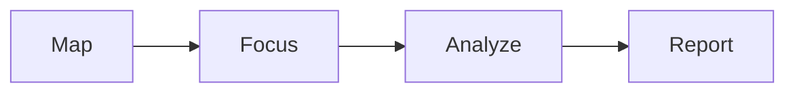

Gecko runs a Claude-powered agent that reads your code like a security engineer.
It follows untrusted input from where it enters your app to where it does damage,
and reports an issue only when it can prove the path is exploitable.

## What a scan produces

<CardGroup cols={2}>
  <Card title="Findings" icon="bug" href="/concepts/findings">
    Each with the full source-to-sink call chain, a CVSS severity, a proof of
    concept, and a ready-to-apply patch.
  </Card>
  <Card title="Repository wiki" icon="book" href="/concepts/repository-wiki">
    An AI-written map of your app: architecture, routing, and security model.
  </Card>
  <Card title="Endpoint map" icon="sitemap" href="/concepts/api-spec">
    The HTTP attack surface Gecko discovered in your code.
  </Card>
  <Card title="PR reviews & fixes" icon="code-pull-request" href="/scanning/pr-checks">
    On pull requests, a security review summary and one-click fixes.
  </Card>
</CardGroup>

## The scan pipeline

A [deep scan](/concepts/scans) maps your codebase so the agent understands your
app, focuses on the security-sensitive code, then traces each path from source to
sink, reporting only proven, high-confidence findings.

## Supported languages

Gecko follows data flow across files using compiler-accurate analysis where
available, and general parsing support everywhere else.

| Support | Languages |
| --- | --- |
| **Compiler-accurate** (precise cross-file analysis) | TypeScript · JavaScript · Python · Go · Java · Scala · C# · Rust |
| **General support** | Ruby · PHP · C · Swift · and more |
